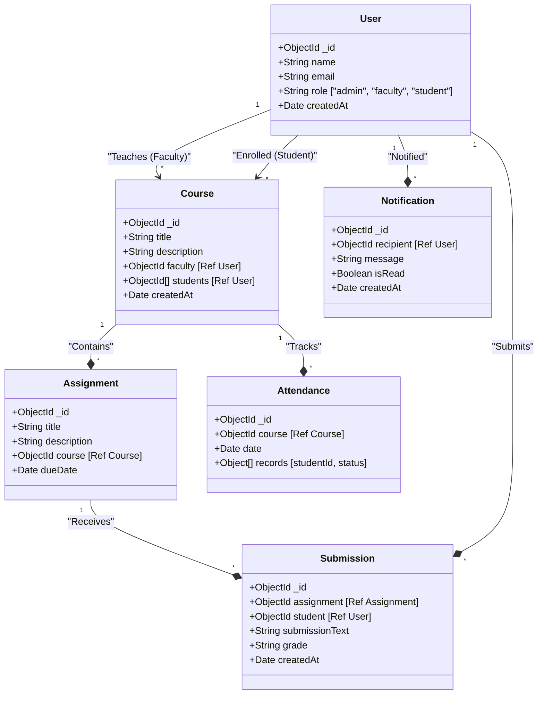

# Smart Campus Management System (SCMS)

A production-ready, role-based academic management platform designed to streamline course coordination, student engagement, and administrative oversight. SCMS provides a high-contrast, utilitarian interface for Admins, Faculty, and Students.

---

## 🚀 Live Demo
*   **Frontend**: [https://scms-rust.vercel.app/](https://scms-rust.vercel.app/)
*   **Backend API**: [https://scms-ux1j.onrender.com](https://scms-ux1j.onrender.com)

---

## 🛠️ Tech Stack
*   **Frontend**: Next.js 14 (App Router), Tailwind CSS, Lucide Icons
*   **Backend**: Node.js, Express.js
*   **Database**: MongoDB Atlas (Mongoose)
*   **Authentication**: JWT (JSON Web Tokens) with Secure LocalStorage
*   **State Management**: React Hooks & Context-based polling

---

## ✨ Features

### 🏛️ For Administrators
*   **Course Creation**: Define new courses and descriptions.
*   **Faculty Assignment**: Dynamically assign registered faculty members to courses.
*   **System Oversight**: Full access to monitor courses and user activity.

### 🎓 For Faculty
*   **Attendance Tracking**: Mark daily attendance (Present/Absent) for all enrolled students in a course.
*   **Assignment Management**: Create and publish assignments with specific due dates.
*   **Grading Center**: View student text submissions and assign grades using multiple strategies (Numeric, Letter, Percentage).

### 📖 For Students
*   **Course Enrollment**: Browse available courses and enroll in academic tracks.
*   **Assignment Dashboard**: Submit work directly through the platform and track deadlines.
*   **Grade Visibility**: View evaluation results and grades instantly on the assignment dashboard.
*   **Attendance History**: Monitor personal attendance records across all enrolled courses.

---

## 📐 Architecture & System Design

### Class Diagram
Below is the core entity relationship and class structure of the SCMS platform:



---

## 🧩 Design Patterns

### 1. Strategy Pattern (Grading Engine)
The grading logic is abstracted into interchangeable strategies resolved at runtime. This allows the system to support different academic standards (Numeric points vs Letter grades) without changing the core submission logic.

### 2. Observer Pattern (Notification System)
A central `Subject` maintains a list of subscribers. Whenever a key event occurs (Assignment Created, Submission Graded), the system automatically pushes a persistent `Notification` to the database for the relevant recipient.

---

## 📦 Project Structure

```text
scms/
├── frontend/             # Next.js Application
│   ├── app/              # App Router (Dashboard, Courses, etc.)
│   ├── components/       # Opaque Sidebar, Navbar, Notifications
│   └── services/         # API Layer (auth, course, attendance)
└── backend/              # Node.js/Express API
    ├── models/           # Mongoose Schemas (User, Course, etc.)
    ├── controllers/      # Business Logic
    ├── routes/           # API Endpoints
    └── utils/            # Strategy & Observer Implementations
```

---

## ⚙️ Local Setup

1.  **Clone the repository**:
    ```bash
    git clone https://github.com/AradhyaTiwari10/scms.git
    ```

2.  **Backend Configuration**:
    *   Navigate to `backend/`
    *   Create a `.env` file with `MONGO_URI`, `JWT_SECRET`, and `PORT=5000`.
    *   Run `npm install && npm start`.

3.  **Frontend Configuration**:
    *   Navigate to `frontend/`
    *   Create a `.env.local` file with `NEXT_PUBLIC_API_URL=http://localhost:5000/api`.
    *   Run `npm install && npm run dev`.

---

## 📝 License
This project is part of the SDSE Capstone.
