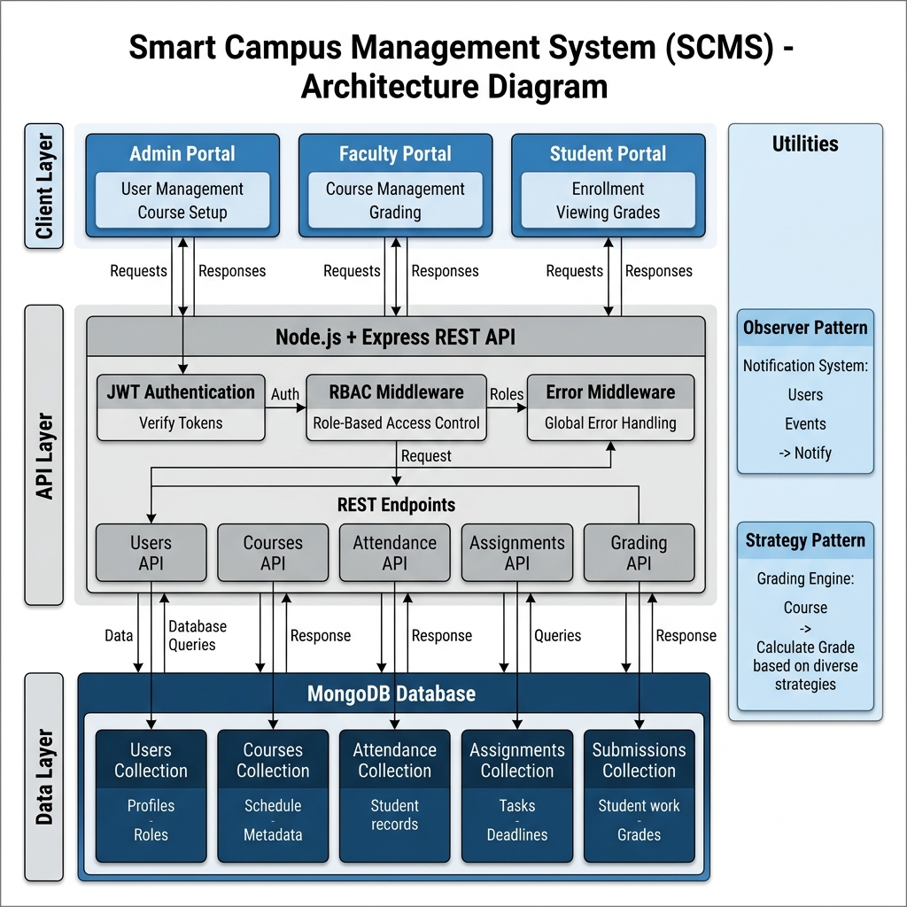
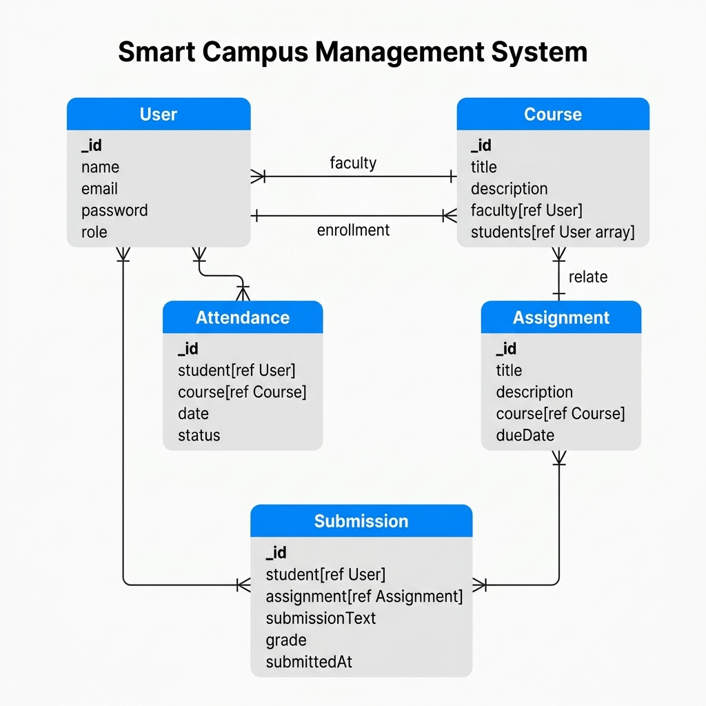
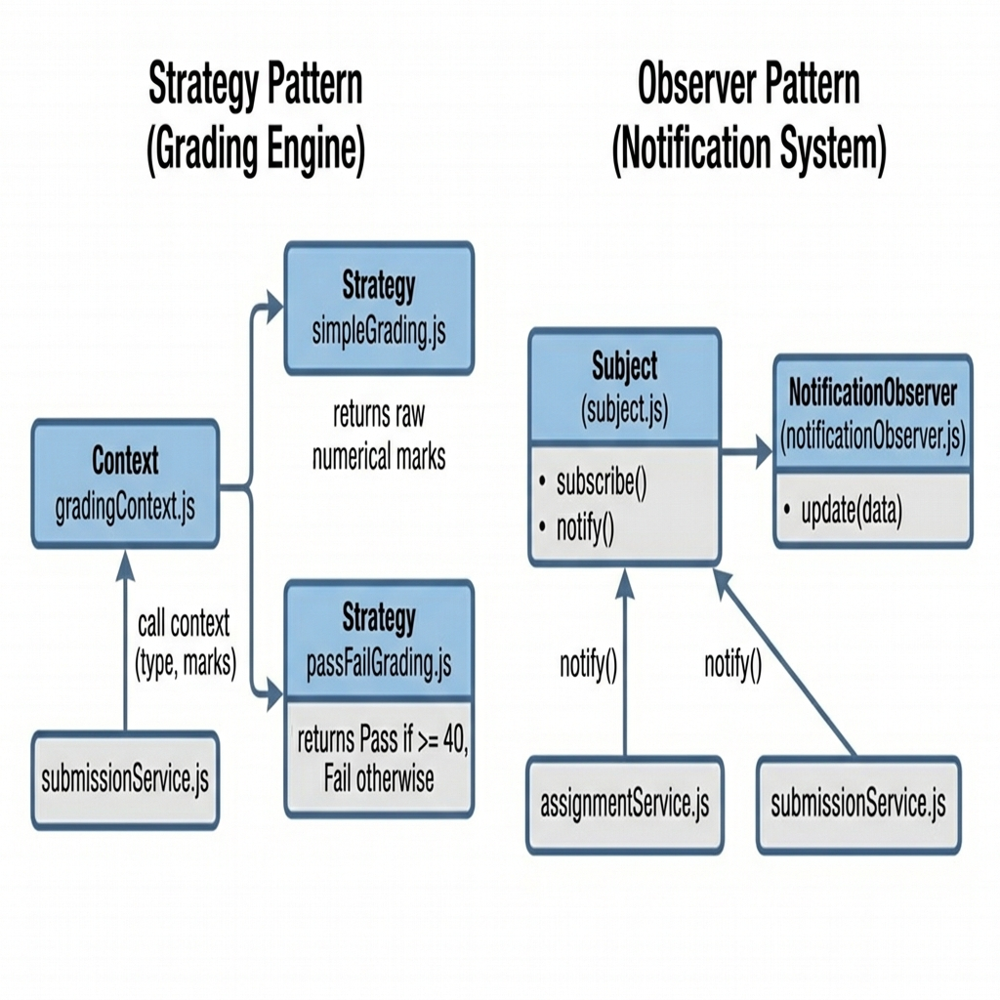

# Smart Campus Management System (SCMS)

A scalable, role-based academic management platform built to manage courses, attendance, assignments, submissions, and grading across three user roles: Admin, Faculty, and Student.

---

## Tech Stack

- **Backend**: Node.js, Express.js
- **Database**: MongoDB (Mongoose)
- **Authentication**: JSON Web Tokens (JWT)
- **API Style**: REST
- **Frontend**: Next.js (Planned)

---

## Features

- **Authentication**: Signup, Login, and JWT-based session management.
- **Role-Based Access Control (RBAC)**: Permission enforcement for `admin`, `faculty`, and `student` roles.
- **Course Management**: Create and retrieve courses with faculty assignments.
- **Enrollment System**: Students enroll in courses, with duplicate prevention.
- **Attendance System**: Faculty mark and view attendance per course. Students view their own records.
- **Assignment Management**: Faculty create assignments linked to courses with due dates.
- **Submission System**: Students submit text responses per assignment, with duplicate submission prevention.
- **Grading System**: Faculty grade submissions using pluggable grading logic via the Strategy Pattern.
- **Notification System**: Automatic console notifications on key events via the Observer Pattern.
- **Global Error Handling**: Centralized error middleware with standardized response shapes.

---

## System Design Diagrams

### System Architecture



### Database Schema (Entity-Relationship)



### Design Patterns



---

## Design Patterns

**Strategy Pattern — Grading Engine**

The grading logic is abstracted into interchangeable strategy functions resolved at runtime. The `gradingContext.js` selects between `simpleGrading` (returns raw marks) and `passFailGrading` (returns "Pass" or "Fail" based on a 40-mark threshold) depending on the `type` parameter passed by the faculty.

**Observer Pattern — Notification System**

A central `Subject` instance maintains a list of subscribed observers. When key events occur (assignment created, submission graded), the subject calls `notify()` which triggers the `update()` method on all registered observers. This decouples event producers from event consumers.

---

## Project Structure

```
backend/
  ├── config/
  ├── controllers/
  ├── services/
  ├── routes/
  ├── models/
  ├── middlewares/
  ├── utils/
  │     ├── observer/
  │     └── gradingStrategies/
  └── server.js
```

---

## API Testing Flow

The following end-to-end flow can be tested using Postman:

1. Signup users with roles: admin, faculty, student.
2. Login with each user to obtain JWT tokens.
3. Create a course (admin token required).
4. Enroll a student into the course (student token required).
5. Mark attendance for the student (faculty token required).
6. View attendance — faculty by course, student by their own records.
7. Create an assignment for the course (faculty token required).
8. Submit an assignment response (student token required).
9. View all submissions for an assignment (faculty token required).
10. Grade a submission, specifying `type: "simple"` or `type: "passfail"` (faculty token required).

---

## API Reference

### POST /api/auth/signup

**Request:**
```json
{
  "name": "Jane Doe",
  "email": "jane@university.edu",
  "password": "Password123",
  "role": "student"
}
```

**Response:**
```json
{
  "success": true,
  "data": { "message": "User registered successfully" }
}
```

### POST /api/auth/login

**Request:**
```json
{
  "email": "jane@university.edu",
  "password": "Password123"
}
```

**Response:**
```json
{
  "success": true,
  "data": { "token": "eyJ..." }
}
```

### POST /api/courses (admin only)

**Request:**
```json
{
  "title": "Machine Learning 101",
  "description": "Introduction to ML concepts",
  "faculty": "<faculty_user_id>"
}
```

**Response:**
```json
{
  "success": true,
  "data": { "_id": "...", "title": "Machine Learning 101" }
}
```

### POST /api/submissions (student only)

**Request:**
```json
{
  "assignmentId": "<assignment_id>",
  "submissionText": "My answer is..."
}
```

**Response:**
```json
{
  "success": true,
  "data": { "message": "Submission successful" }
}
```

### POST /api/submissions/grade (faculty only)

**Request:**
```json
{
  "submissionId": "<submission_id>",
  "marks": 75,
  "type": "simple"
}
```

**Response:**
```json
{
  "success": true,
  "data": { "message": "Graded successfully", "grade": 75 }
}
```

---

## Project Status

**Backend:**
- Authentication — complete
- Role-Based Access Control — complete
- Course System — complete
- Enrollment — complete
- Attendance — complete
- Assignment System — complete
- Submission System — complete
- Grading (Strategy Pattern) — complete
- Notifications (Observer Pattern) — complete
- Global Error Handling — complete

**Frontend:**
- Not started

---

## Future Scope

- Frontend integration using Next.js
- Real-time notifications via WebSockets (Socket.io)
- File upload support for assignment submissions (AWS S3 / Multer)
- Admin analytics dashboard for monitoring system-wide activity